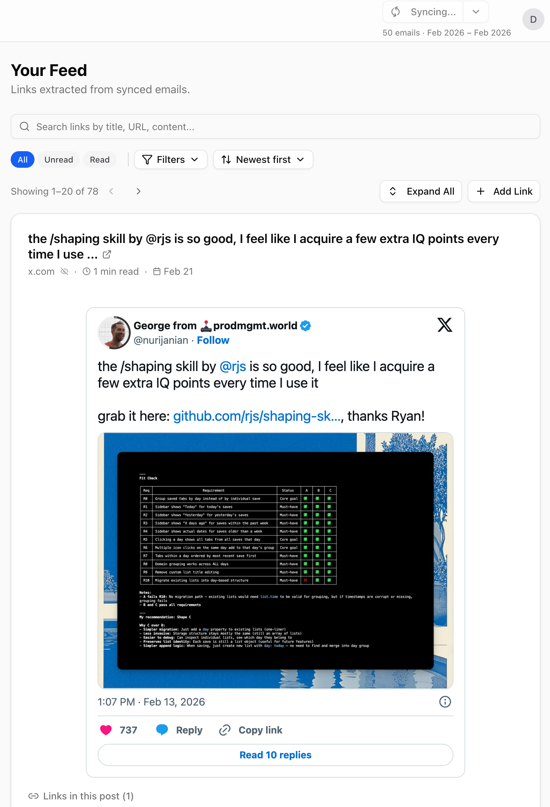
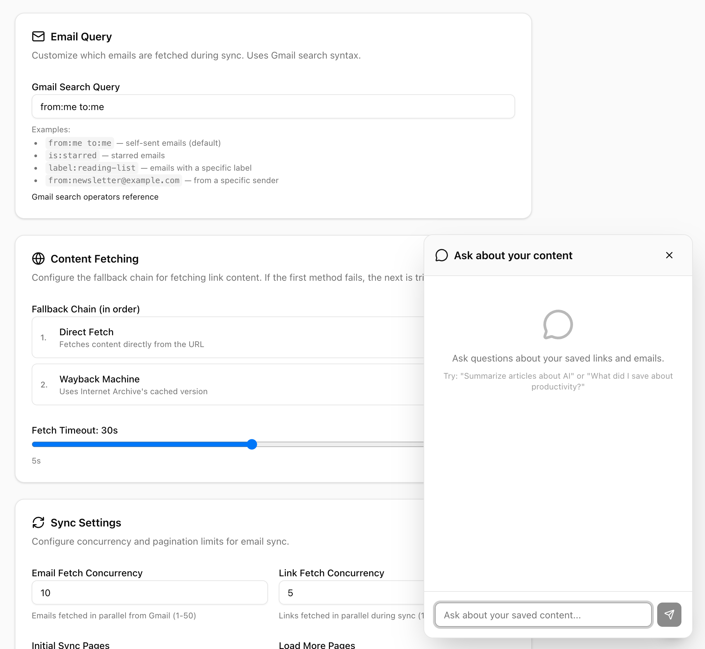
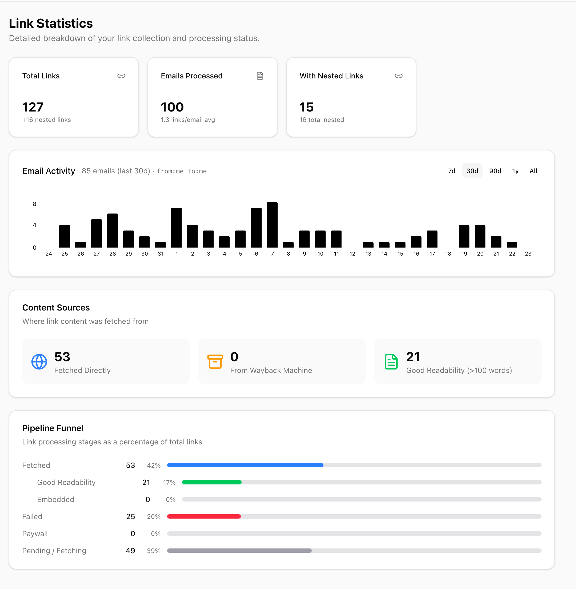

# MailFeed

**Your reading list, owned by you.**

Turn your emails into a personalized reading feed with full-text content, semantic search, and smart link extraction. Self-hosted, open source, and private by design.

> *"If you've ever emailed yourself before, this app is for you."*
>
> *"I mean, doesn't everyone do this?"* — David

> *"Another read-it-later app shut down and took my whole library with it. Never again."*
> — David, after losing his bookmarks for the third time

> *"I already email myself links. Why not just turn that into the whole app?"*
> — David, at 2 AM, convincing himself to build this

> *"I miss RSS readers. I miss Google Reader. I will not let go."*
> — David, mass-replying to everyone who said RSS is dead

## How It Works

1. Email yourself a link (or any email matching your configured query)
2. MailFeed syncs it, extracts the links, and fetches the full article content
3. Browse everything in a clean reading feed with search and filters

## How It Looks



<details>
<summary>More screenshots</summary>

### Settings & Chat



### Link Statistics



</details>

## Features

- **Gmail Integration** — Syncs emails you send to yourself (`from:me to:me`) by default, configurable to any Gmail query
- **Smart Link Extraction** — Automatically finds, deduplicates, and follows redirects to surface real URLs
- **Content Fetching** — Fetches full articles with Mozilla Readability, falls back to the Wayback Machine for lost content
- **Reading Feed** — Clean interface with filters, search, categories, and reading time estimates
- **Semantic Search** — Chat with your saved links using vector embeddings and RAG-powered search
- **AI Analysis** — *(Coming Soon)* Summaries, key points, categorization, and content scoring

## Quick Start

### One-command setup (macOS)

```bash
curl -fsSL https://raw.githubusercontent.com/toothbrush-inc/mailfeed/main/scripts/setup.sh | bash
```

This installs Docker if needed, clones the repo, walks you through entering your Google credentials, and starts everything. Open [http://localhost:3000](http://localhost:3000) when it's done.

**You'll need:**
- Google OAuth credentials ([create them here](https://console.cloud.google.com/apis/credentials/oauthclient)) with the Gmail API enabled
- *(Optional)* A [Gemini API key](https://aistudio.google.com/apikey) for AI features — you can add this later

### Manual setup

```bash
git clone https://github.com/toothbrush-inc/mailfeed.git
cd mailfeed
cp .env.example .env        # Add your Google credentials
docker compose up --build -d # Start the app + database
```

Open [http://localhost:3000](http://localhost:3000).

### Developer setup (without Docker)

```bash
git clone https://github.com/toothbrush-inc/mailfeed.git
cd mailfeed
npm install
cp .env.example .env        # Add your credentials + DATABASE_URL
docker compose up -d postgres # Start just the database
npx prisma db push          # Apply schema
npm run dev                 # Start dev server
```

## Google Cloud Setup

You need a Google Cloud project with OAuth credentials to sign in and access Gmail.

1. [Create a Google Cloud project](https://console.cloud.google.com/projectcreate)
2. [Enable the Gmail API](https://console.cloud.google.com/apis/library/gmail.googleapis.com)
3. [Create OAuth 2.0 credentials](https://console.cloud.google.com/apis/credentials/oauthclient) (Web application)
   - Add redirect URI: `http://localhost:3000/api/auth/callback/google`
4. Configure the [OAuth consent screen](https://console.cloud.google.com/apis/credentials/consent)
   - Add scope: `https://www.googleapis.com/auth/gmail.readonly`
   - Add your email as a test user (if using External)
5. Copy the Client ID and Client Secret into your `.env`

**Gemini API (optional):** Get a key from [Google AI Studio](https://aistudio.google.com/apikey) and add it as `GEMINI_API_KEY` in `.env`. This enables semantic search and AI features.

## Docker Commands

```bash
docker compose up -d          # Start everything
docker compose down           # Stop (data persists)
docker compose down -v        # Stop and delete all data
docker compose logs -f app    # View app logs
docker compose logs -f postgres # View database logs
```

### Updating Environment Variables

To add or change a variable (e.g. adding `GEMINI_API_KEY` later):

1. Edit `.env` in the project root
2. Restart the container: `docker compose up -d app`

No rebuild needed — the container reads `.env` at startup.

## Development

```bash
npm run dev          # Start development server
npm run build        # Production build
npm run lint         # Run ESLint
npx prisma studio    # Database GUI
npx prisma db push   # Apply schema changes
```

## Architecture

```
app/
├── (auth)/login/          # Login page
├── (dashboard)/           # Protected routes
│   ├── feed/              # Main reading feed
│   ├── emails/            # Email list view
│   ├── settings/          # User settings
│   └── reports/           # Reported links
├── api/
│   ├── sync/              # Email sync endpoint
│   ├── links/             # Link CRUD
│   ├── chat/              # RAG chatbot
│   └── embeddings/        # Vector embeddings
components/                # React components
lib/                       # Core logic
├── gmail.ts               # Gmail API integration
├── content-fetcher.ts     # Article extraction
├── gemini.ts              # AI analysis
├── embeddings.ts          # Vector embeddings
└── vector-search.ts       # Similarity search
```

## Tech Stack

- **Framework**: Next.js 16 (App Router)
- **Database**: PostgreSQL + pgvector
- **ORM**: Prisma
- **Auth**: NextAuth.js v5
- **AI**: Google Gemini
- **UI**: React 19, Tailwind CSS v4, shadcn/ui

## FAQ

See [FAQ.md](FAQ.md) for common questions about privacy, email syncing, AI features, and more.

## License

MIT
